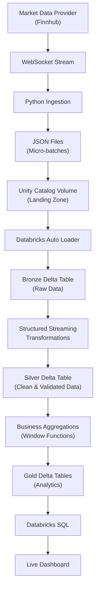

# Real-Time Market Data Lakehouse

Real-time streaming data platform using the Databricks Lakehouse architecture and the Medallion Architecture (Bronze → Silver → Gold). Visualized analytics with Databricks SQL.

## Draft Architecture
