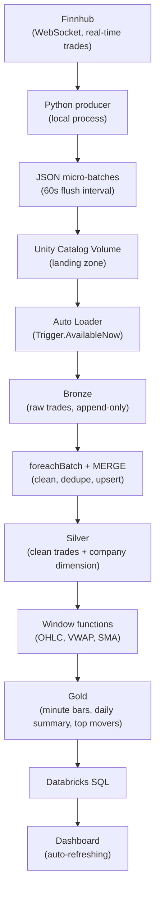
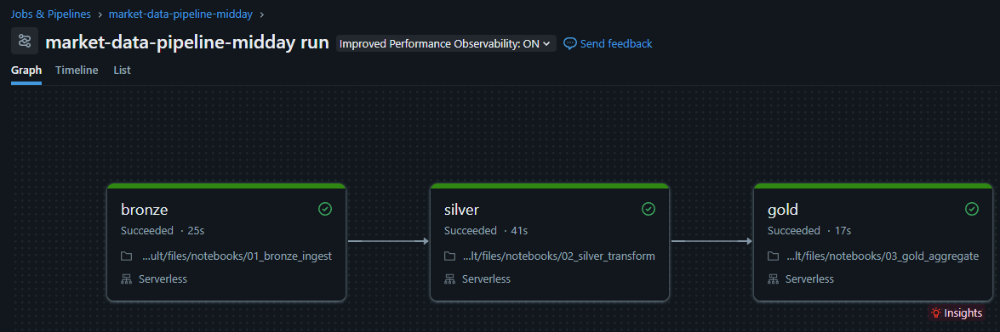
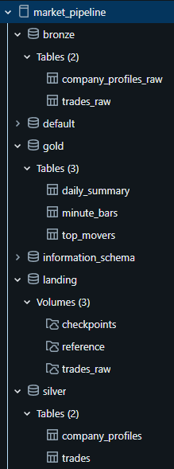
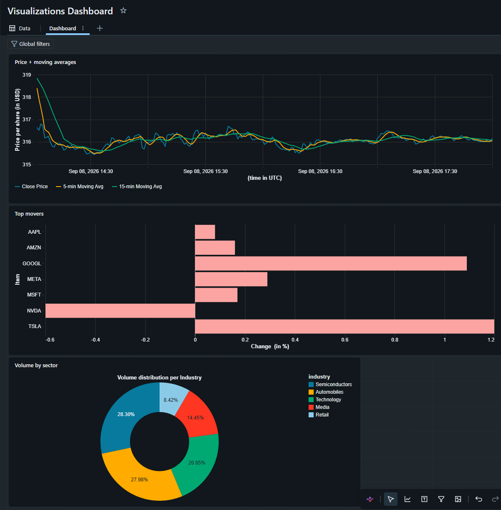

# Real-Time Market Data Lakehouse

A streaming data platform that ingests live US stock trades from Finnhub, lands them in a Databricks Lakehouse, and processes them through a medallion architecture (Bronze → Silver → Gold) into OHLC candlestick bars, moving averages, and daily summaries — visualized in a live-refreshing Databricks SQL dashboard.

Built on **Databricks Free Edition** (serverless), which restricts outbound internet access from notebooks and jobs. Rather than working around that, the architecture leans into it: an external Python process owns ingestion, and the lakehouse only ever reads from cloud storage — the same separation real production systems use for governance reasons.

## Architecture



Orchestrated end-to-end by **Databricks Workflows**, scheduled across market hours (9:30–16:00 ET) via three jobs defined in `databricks/databricks.yml` (a Databricks Asset Bundle), so the bronze → silver → gold chain runs automatically without manual triggering.

## Tech stack

| Layer | Tool |
|---|---|
| Ingestion | Python, `websocket-client`, Finnhub API |
| Storage | Delta Lake, Unity Catalog Volumes |
| Processing | PySpark, Structured Streaming, Auto Loader |
| Orchestration | Databricks Workflows / Asset Bundles |
| Serving | Databricks SQL, dashboards |
| CI | GitHub Actions (pytest, ruff) |

## Repository structure

```
producer/            Local ingestion: WebSocket client, reference data loader, volume uploader
notebooks/            Bronze, silver, gold Databricks notebooks
src/transforms/       Testable PySpark transform functions (imported by the notebooks)
sql/                  Unity Catalog setup (catalog, schemas, volumes)
databricks/           Databricks Asset Bundle — job definitions and schedule
pipeline/             One-click PowerShell script: validate + deploy bundle, start producer
tests/                Unit tests for src/transforms, run locally and in CI
```

## How it works

**Ingestion.** A Python process holds a WebSocket connection to Finnhub, buffers incoming trades in memory, and every 60 seconds flushes them as a newline-delimited JSON file, uploaded directly into a Unity Catalog Volume via the Databricks SDK. A separate one-off script pulls company reference data (name, industry, market cap) for the tracked symbols.

**Bronze.** Auto Loader incrementally ingests new files from the landing volume. Since Free Edition serverless doesn't support continuous streaming triggers, this runs as `Trigger.AvailableNow()` inside a scheduled job — each run processes everything new since the last checkpoint, then exits.

**Silver.** Cleans and validates raw trades (drops null/non-positive price or volume), then upserts into a Delta table via `foreachBatch` + `MERGE` — the standard pattern for doing idempotent upserts inside Structured Streaming, since Delta's streaming sinks don't support `MERGE` directly. Company reference data is upserted the same way as a SCD Type 1 dimension table.

**Gold.** Builds 1-minute OHLCV bars per symbol using `groupBy(window(...))`, adds 5- and 15-minute moving averages via window functions, rolls bars up into daily summaries, and ranks symbols by absolute daily % change for a "top movers" table.

**Dashboard.** Databricks SQL queries against the gold tables, visualized as line charts (price + moving averages), bar charts (top movers, volume by sector), refreshed on a schedule.

## Design decisions worth knowing about

- **Ingestion runs outside Databricks entirely.** Free Edition restricts notebook/job outbound network access to a trusted domain allowlist — calling an external API directly from a notebook isn't reliably possible. Rather than fight that, ingestion became a standalone process, which mirrors how many real systems are built for security/governance reasons anyway.
- **`trade_id` is derived from bronze row identity, not trade content.** An early version hashed `(symbol, price, volume, timestamp_ms)` into an ID for deduplication — but genuinely distinct trades legitimately share all four fields when multiple fills print at the same price/size within the same millisecond, so this was silently discarding real trades as "duplicates." Fixed by tagging each row with `monotonically_increasing_id()` at bronze ingestion time and keying identity off that instead.
- **`Trigger.AvailableNow()` instead of a continuous stream.** Serverless compute doesn't support time-based streaming triggers, so each pipeline run processes everything that's landed since the last checkpoint on a schedule, rather than running continuously. This is also a legitimate cost-saving pattern outside of that constraint.

## Known limitations

- Live trade data only flows during US market hours (9:30–16:00 ET, weekdays) — outside that window the WebSocket is connected but idle, which is expected.
- Gold tables are fully recomputed (`overwrite`) on each run rather than incrementally merged — fine at this data volume, but a natural next step would be an incremental `MERGE` on `(symbol, bar_start)`.
- Free Edition's compute and job-concurrency quotas cap how tightly the schedule can run without risking overlapping/skipped executions.

## Screenshots

**Pipeline run (Databricks Workflows)**


**Catalog structure (bronze/silver/gold in Unity Catalog)**


**Dashboard**


## Running it locally

1. `conda env create -f environment.yml` — sets up the producer's environment
2. Copy `.env.example` to `.env` and fill in your Finnhub API key and Databricks workspace credentials
3. Run `sql/setup_catalog.sql` once in the Databricks SQL Editor to create the catalog, schemas, and volumes
4. `pipeline/run_pipeline.ps1` — validates and deploys the Databricks Asset Bundle, then starts the producer

CI runs automatically on every push via GitHub Actions (`.github/workflows/ci.yml`) — unit tests for the transform logic in `src/transforms/`, plus `ruff` for linting.
